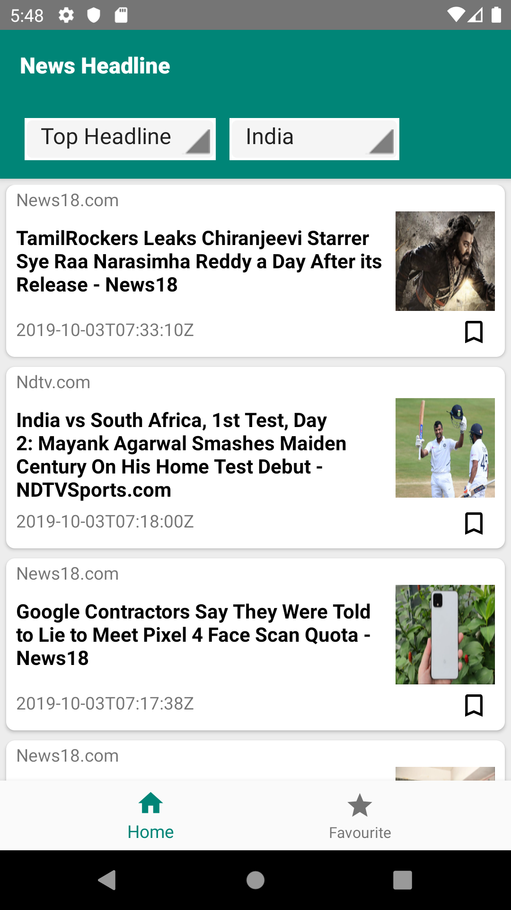
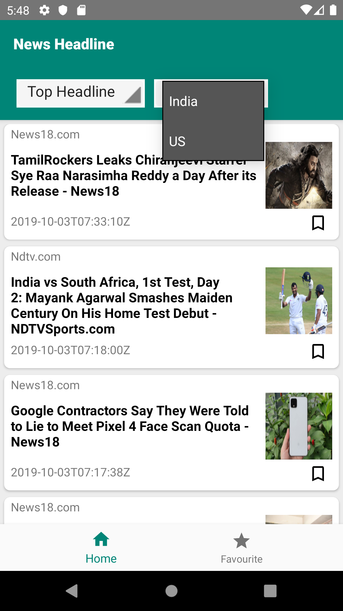
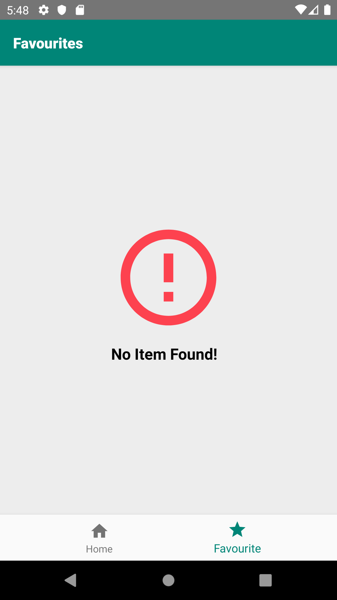
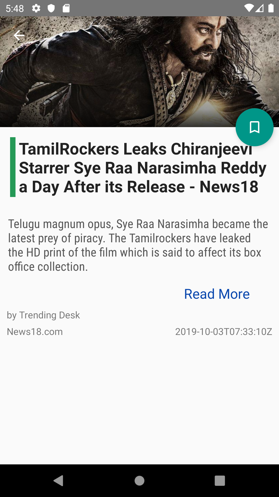

# News App

The News app for daily news & trending news for different country filter using MVVM architecture, Jetpack component, Dagger 2 , RxAndroid with Unit testing (JUnit) & UI testing (Espresso) 
**Note:** Generate Api Key for this App from News Api & paste in UrlConstant to execute this project - [Get Here](https://newsapi.org/register)   

        
        
        

 

       
        

#### The app has following packages:
1. **activity**: It contains all the activity in the app
2. **adapter**: Adapter classes in the project
3. **base**: base classes of the project
4. **di**: Dependency providing classes using Dagger2.
5. **fragment**: fragment of the app
6. **model** : model used in the appp
7. **util**: Utility class used in the app
8. **viewmodel**: View Model content 

### Library reference resources:
1. Data binding: https://developer.android.com/topic/libraries/data-binding/
2. Dagger2:  https://dagger.dev/users-guide (Documentation)   &nbsp; &nbsp; &nbsp; &nbsp; &nbsp; &nbsp;  &nbsp;&nbsp; &nbsp;&nbsp;
             https://github.com/shivamratan/mvvm-architecture (Sample)
3. RxJava2: http://reactivex.io/documentation (Documentation)  &nbsp; &nbsp; &nbsp; &nbsp; &nbsp;  &nbsp;&nbsp; &nbsp;&nbsp;
            https://github.com/shivamratan/mvvm-architecture (Sample)  
4. MVVM architecture: https://github.com/shivamratan/mvvm-architecture
5. Retrofit: https://square.github.io/retrofit/
6. ViewModel: https://developer.android.com/topic/libraries/architecture/viewmodel
7. LiveData:  https://developer.android.com/topic/libraries/architecture/livedata
8. Room: https://developer.android.com/topic/libraries/architecture/room.html

### Looking for Kotlin MVVM Architecture - [Check here](https://github.com/shivamratan/mvvm-architecture)